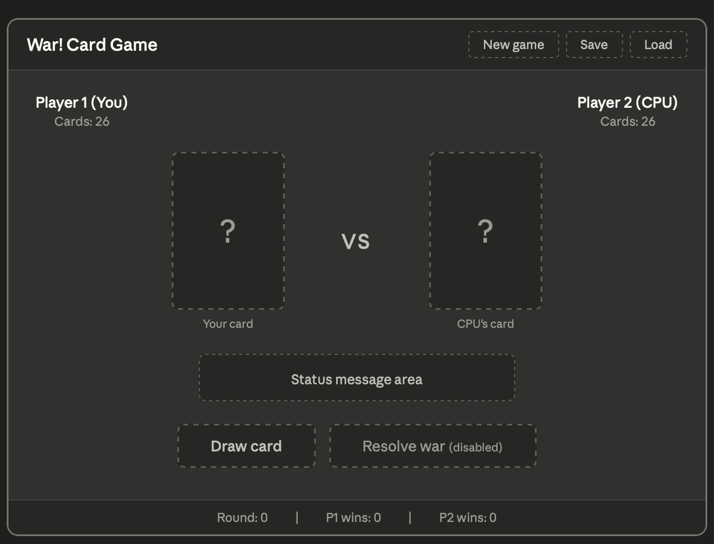

# Unit Deliverable 2 — War! Card Game GUI

## Project Description

This project is a Java implementation of the classic **War** card game, built with **JavaFX** for the GUI and following the **Model-View-Controller (MVC)** design pattern. The game puts a human player (you) against a CPU opponent — each round both players draw a card, and the higher rank wins. Tied ranks trigger a "War" sequence where additional cards are staked.

UD2 focuses on building the **front-end (View + Controller)** and integrating the `PlayingCard` model class from UD1 as a proof of concept. The full game logic (Deck, Player, WarGame) and File I/O (save/load) will be connected in UD3.

---

## GUI Wireframe

The wireframe below shows the bare-bones layout designed before any code was written. (All components from the wireframe are implemented in the actual FXML).

**Layout breakdown:**

- **Top bar** — Game title + three menu buttons (New Game, Save, Load)
- **Player info row** — Player names and card counts displayed on each side
- **Card display area** — Two card zones (Player 1 and Player 2) flanking a center "VS" indicator
- **Status message** — A dynamic label in the center that updates each round with the result
- **Action buttons** — "Draw Card" (always active) and "Resolve War" (disabled until a tie occurs)
- **Score bar (bottom)** — Round counter and win tallies for both players

---

## UD2 Implementation Details

### New files in this deliverable

| File                  | Role                                                                     | Layer (MVC)    |
|-----------------------|--------------------------------------------------------------------------|----------------|
| `WarGameApp.java`     | Main entry point — loads FXML and launches the JavaFX window             | Application    |
| `game.fxml`           | GUI layout built with SceneBuilder — all components and `fx:id` bindings | **View**       |
| `GameController.java` | Handles all button events, updates UI labels                             | **Controller** |

### Event handlers Wired

Every button in the GUI is connected to a handler method in `GameController`:

- **Draw Card** → `handleDraw()` — Creates two random `PlayingCard` objects, displays them, and uses `beats()` to determine the round winner
- **Resolve War** → `handleResolveWar()` — Stub; prints to console (full war logic in UD3)
- **New Game** → `handleNewGame()` — Resets all labels, counters, and card displays to initial state
- **Save** → `handleSave()` — Stub; prints to console (File I/O in UD3)
- **Load** → `handleLoad()` — Stub; prints to console (File I/O in UD3)

### PlayingCard integration (proof of concept)

The `handleDraw()` method demonstrates the UD1 model class working inside the GUI:

1. Randomly selects a `Suit` and `Rank` from their enum values for each player
2. Creates two `PlayingCard` objects using the full constructor
3. Displays each card in the GUI using `PlayingCard.toString()`
4. Calls `PlayingCard.beats()` to compare ranks and updates the status label with the result
5. On a tie, enables the "Resolve War" button

This helps demonstrate how the **Model → Controller → View** pipeline works end-to-end, even before the full game engine is built.

---

## How to Run

1. Open the project in **IntelliJ IDEA**
2. Ensure JavaFX SDK is configured (VM options: `--module-path /path/to/javafx/lib --add-modules javafx.controls,javafx.fxml`)
3. Run `WarGameApp.java`

---

## What's Next (UD3)

- Build remaining model classes: `Deck`, `Player` (abstract), `HumanPlayer`, `AIPlayer`, `WarGame`
- Connect full game logic to the GUI (replace random card generation with actual deck/hand management)
- Implement `EmptyDeckException` for edge cases (player runs out of cards mid-war)
- Add File I/O with `GameState` serialization for save/load functionality
- Polish: game-over state, win animations(maybe), and final presentation prep