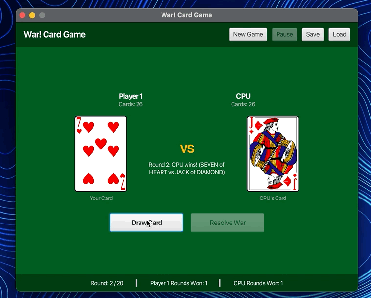
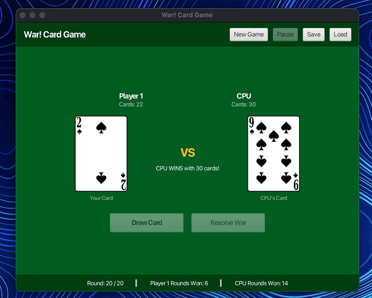
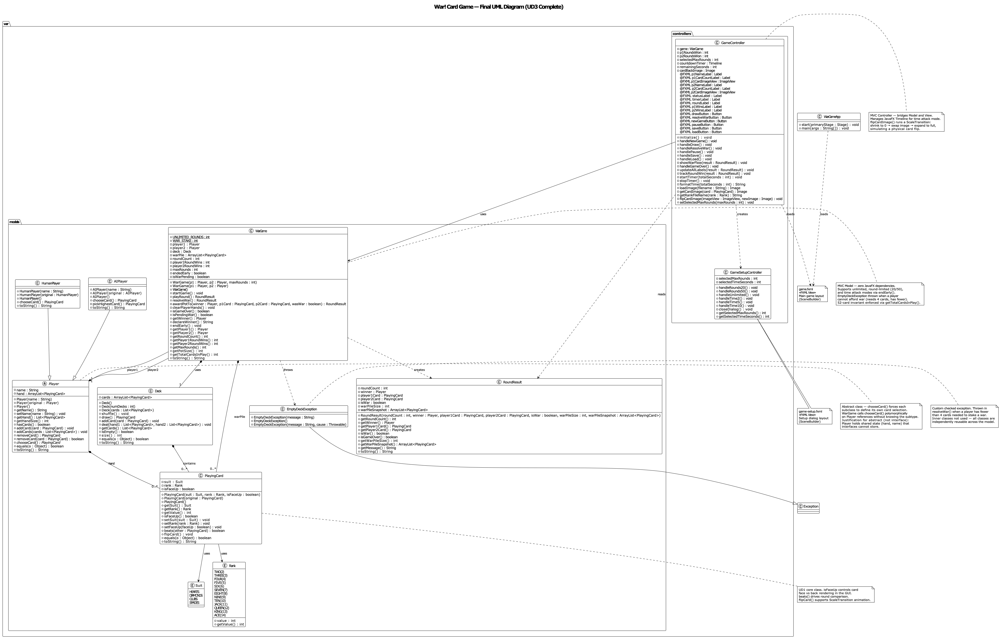
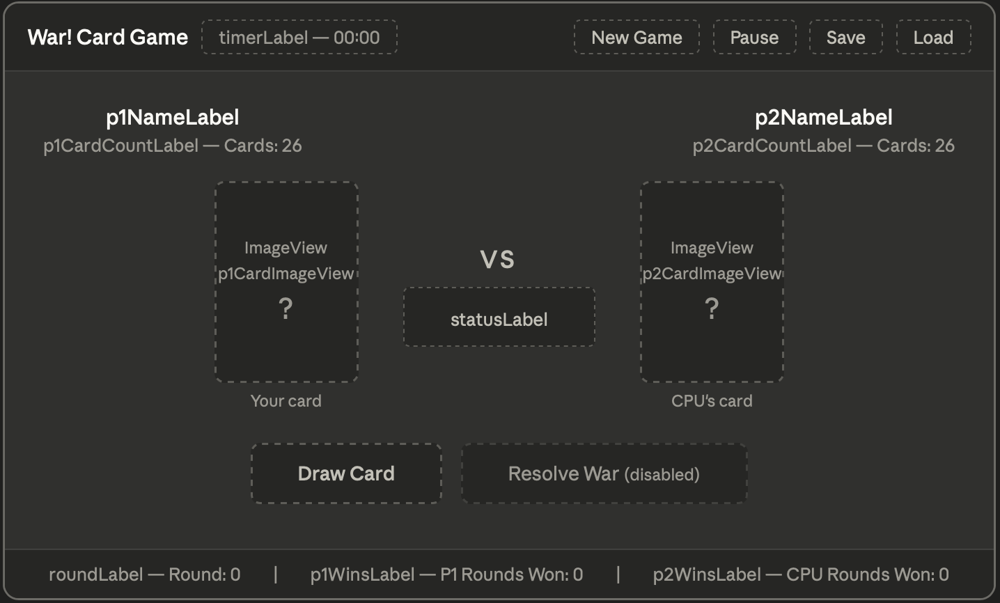
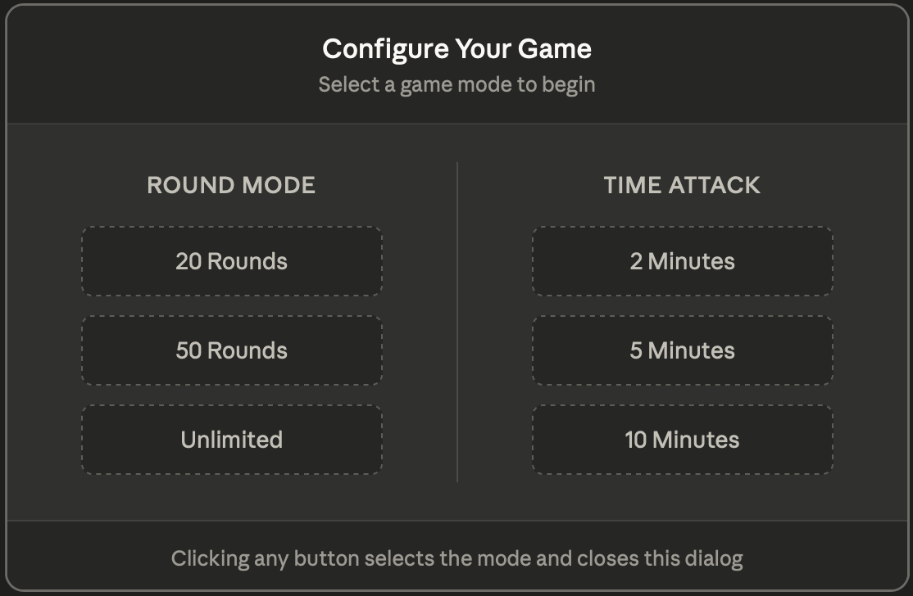

# War! Card Game — Final Project (UD3)
### CS112 | Nathan Tshishimbi | Spring 2026

---

## Project Description

**War!** is a fully playable digital adaptation of the classic card game built in Java using JavaFX for the graphical interface. The game that looks simple on the surface but has surprisingly interesting edge cases (ties, wars within wars, running out of cards mid-battle) which made it a perfect fit for applying object-oriented design patterns. The game pits a human player against a CPU opponent across multiple game modes, including round-limited games, time attack countdowns, and classic unlimited play (which can get kind of boring in my opinion). Built following the Model-View-Controller (MVC) architecture, the game logic is completely decoupled from the JavaFX interface, meaning every rule, round result, and war resolution happens in pure Java with no UI dependencies.

---

## Animated Demos

*Round-based Mode Demo*


*Time-Attack Game Mode Demo*


---

## Inspiration

The project was inspired by a personal experience growing up playing War (alongside another game called "Egyptian Rat Slap" (which has a bit more strategy involved), both with a physical deck of cards. I have countless memories playing Egyptian Rat Slap with my brother and we stil play it from time to time till this day, as we are both extremely competative!
Upon seeing the game on the offical website *[CardGames.io](https://cardgames.io/war/)* I knew I could try to build something similar!

---

## UML Diagram

*Below is the updated and final UML Diagram for the UD3 and Final Project*


*(This has been significantly updated from UD1 — see the Changes section below for what changed and why)*

---

## GUI Wireframe

>*Below are the updated GUI Wireframes from UD2; finalized to represent the completed Project!*

*Wireframe 1 of 2 — Main Game Window (game.fxml)*


*Wireframe 2 of 2 — Setup Dialog (game-setup.fxml)*


*(Original wireframe from UD2 — the final GUI closely follows this layout)*


---

## How to Run

> ⚠️ **This section is critical — please read before opening the project.**
> If the JavaFX runtime is not configured correctly, the application will not launch.

### Requirements

| Tool | Version |
|------|---------|
| Java (JDK) | 21 or higher |
| JavaFX SDK | 22.0.1 (matches project configuration) |
| IntelliJ IDEA | 2023.x or higher recommended |
| Maven | Bundled with IntelliJ (no separate install needed) |

### Step 1 — Clone the repository

```bash
git clone https://github.com/CS112-3666-Spring2026/ud3-final-project-rootkit404.git
cd ud3-final-project-rootkit404
```

### Step 2 — Open in IntelliJ IDEA

- Open IntelliJ → **File → Open** → select the cloned project folder
- IntelliJ will detect the `pom.xml` and import it as a Maven project automatically
- Wait for the Maven sync to complete (bottom progress bar)

### Step 3 — Configure JavaFX SDK

Upon downloading and opening the project in IntelliJ, open a terminal in project root and run:
> mvn javafx:run

Then jump to Step 5 and enjoy!

###

### **⚠️ If you see *"The JavaFX runtime is not configured"* in the editor:**

1. Download JavaFX SDK 22.0.1 from [gluonhq.com/products/javafx](https://gluonhq.com/products/javafx/)
2. Extract it to a stable location on your machine (e.g. `/Users/you/javafx-sdk-22.0.1`)
3. In IntelliJ: **File → Project Structure → Libraries → + → Java**
4. Navigate to the `lib` folder inside your JavaFX SDK and select it

### Step 4 — Configure VM Options

1. In IntelliJ: **Run → Edit Configurations**
2. Select `WarGameApp` (or create a new Application config pointing to `war.WarGameApp`)
3. In the **VM options** field under *"Modify Options"*, add:

```
--module-path /path/to/javafx-sdk-22.0.1/lib
--add-modules javafx.controls,javafx.fxml,javafx.graphics
```

Replace `/path/to/javafx-sdk-22.0.1/lib` with the actual path on your machine.

### Step 5 — Run!

- Run `WarGameApp.java` using the green ▶ button
- The game setup screen will appear — select a game mode and play!

---

## How to Play

1. **Launch the app** — the main game window opens with both card zones showing the back of a card
2. **Click "New Game"** — a setup dialog appears with six game mode options:

| Mode        | Description                                                      |
|-------------|------------------------------------------------------------------|
| 20 Rounds   | Game ends after 20 rounds; most cards wins                       |
| 50 Rounds   | Game ends after 50 rounds; most cards wins                       |
| Unlimited   | Play until one player runs out of cards                          |
| 2 Minutes   | Timer counts down from 2:00; most cards when time runs out wins  |
| 5 Minutes   | Timer counts down from 5:00; most cards when time runs out wins  |
| 10 Minutes  | Timer counts down from 10:00; most cards when time runs out wins |

1. **Click "Draw Card"** — both players reveal their top card with a flip animation
2. **Higher card wins the round** and takes both cards
3. **On a tie — WAR!** A popup appears; click OK to stake 3 face-down cards + 1 face-up each. Highest war card wins everything in the pile
4. **Pause** (time attack only) — freezes the timer and disables Draw until resumed
5. **Game ends** when a player runs out of cards, the round limit is hit, or the timer expires

---

## Project Structure

```
src/
└── main/
    ├── java/
    │   └── war/
    │       ├── WarGameApp.java              ← Application entry point
    │       ├── controllers/
    │       │   ├── GameController.java      ← Main game event handler
    │       │   └── GameSetupController.java ← Setup dialog controller
    │       └── models/
    │           ├── PlayingCard.java         ← Card model (UD1 class)
    │           ├── Suit.java                ← Suit enum
    │           ├── Rank.java                ← Rank enum (with int values)
    │           ├── Deck.java                ← 52-card deck with shuffle/deal
    │           ├── Player.java              ← Abstract player base class
    │           ├── HumanPlayer.java         ← Human player (extends Player)
    │           ├── AIPlayer.java            ← CPU player (extends Player)
    │           ├── WarGame.java             ← Core game engine
    │           ├── RoundResult.java         ← Round outcome data class
    │           └── EmptyDeckException.java  ← Custom checked exception
    └── resources/
        └── war/
            ├── game.fxml                    ← Main game layout (SceneBuilder)
            ├── game-setup.fxml              ← Setup dialog layout
            └── images/                      ← Card PNG assets (htdebeer/SVG-cards)
```

---

## OOP Concepts Applied

| Concept | Where |
|---------|-------|
| **Concrete class** | `PlayingCard`, `Deck`, `HumanPlayer`, `AIPlayer`, `WarGame` |
| **Abstract class** | `Player` — shared hand/name state + forces `chooseCard()` override |
| **Inheritance** | `HumanPlayer` and `AIPlayer` both extend `Player` |
| **Polymorphism** | `WarGame` calls `player.chooseCard()` without knowing the subtype |
| **Custom exception** | `EmptyDeckException` — thrown when a player runs out mid-war |
| **ArrayList + Generics** | `Deck`, player hands, and war pile all use `ArrayList<PlayingCard>` |
| **JavaFX + Event-driven** | All six buttons wired to `@FXML` handlers in `GameController` |
| **MVC pattern** | Model (`war.models`) has zero JavaFX imports; View is FXML; Controller bridges them |

---

## Changes Made from Original Plan + What Got Cut

### What changed from UD1 and UD2

The class structure stayed close to the original UML, but a few things evolved during implementation:

- `Card` was renamed to `PlayingCard` and gained `isFaceUp`, `flipCard()`, and `beats()` — more expressive than a raw `compareTo()`
- `Rank` became a full enum with embedded integer values (`TWO(2)` through `ACE(14)`) instead of storing a plain `int` in `Card`
- `WarGame.playRound()` was split from `resolveWar()` to give the GUI controller full control over pacing — the war popup needed to fire between those two calls
- `RoundResult` was added as a standalone class (not nested in `WarGame`) to bundle round outcomes for the controller
- A title screen (`GameSetupController` + `game-setup.fxml`) was added in UD3 to support multiple game modes
- Card text labels were replaced with `ImageView` elements backed by PNG card assets with a `ScaleTransition` flip animation

### What got cut

**File I/O — Save and Load game state** was cut due to time constraints. The original plan included a `GameState` class to handle saving/loading game states. The Save and Load buttons exist in the UI and are wired to handlers in `GameController`, but the serialization logic was not implemented by the deadline.

**Why this decision was made:** The core game loop — dealing, round resolution, war handling, multiple game modes, timer, card flip animations — was prioritized because those features are visible and demonstrate the required OOP and JavaFX concepts. File I/O, while required in the unit plan, would have been backend-only work that wouldn't improve the demo experience. Given my time constraints, I believe cutting it was the correct call.

---

## UD1 → UD2 → UD3 Build Summary

| Deliverable | What was built                                                                                                                      |
|-------------|-------------------------------------------------------------------------------------------------------------------------------------|
| **UD1**     | UML diagram, `PlayingCard` class with 3 constructors/getters/setters/equals/toString, `PlayingCardTester`, design justification     |
| **UD2**     | GUI wireframe, JavaFX front-end (`game.fxml` + `GameController` stubs), proof-of-concept `PlayingCard` integration on Draw button   |
| **UD3**     | All remaining model classes, full game loop connected to GUI, war popup, game modes, timer, pause, card images with flip animation  |
